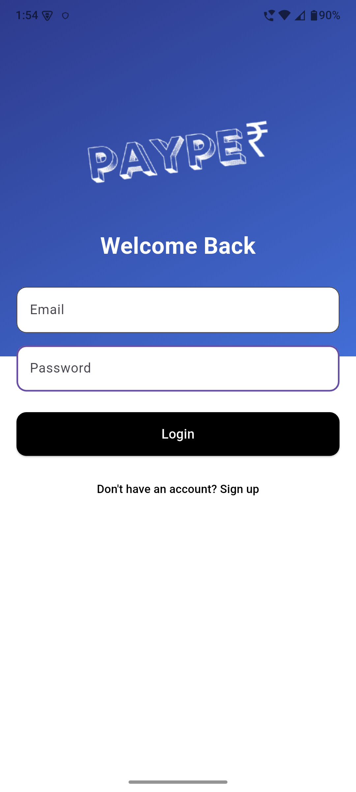

# 🚀 Payper – UPI Simulator App

A **Flutter-based fintech simulation app** that replicates real-world UPI transactions with **real-time updates using Firebase**.

Built to simulate core digital payment flows while focusing on **performance, responsiveness, and real-time data handling**.

---

## 📱 Features

- 🔐 **User Authentication** (Firebase Auth)
- 💸 **Send Money Flow**
- 📊 **Real-time Balance Updates** (Firestore Streams)
- 📜 **Transaction History**
- 👥 **Contacts Selection**
- 🎨 **Clean & Responsive UI**
- ⚡ **Instant UI Sync (No manual refresh required)**

---

## 🛠️ Tech Stack

**Frontend**
- Flutter (Dart)

**Backend**
- Firebase Authentication
- Cloud Firestore (Real-time database)

---

## 🧠 Key Learnings

- Implemented **real-time data handling** using Firestore streams
- Managed **asynchronous operations & state updates** in Flutter
- Designed **responsive and structured UI layouts**
- Solved real-world development challenges:
  - Asset handling
  - Navigation flow
  - Keyboard overflow issues
  - Layout constraints

---

## 📸 Screenshots

### 🏠 Home Screen


### 💸 Send Money


### 📜 Transaction History


### 🔐 Login Screen



---

## ⚙️ Setup Instructions

```bash
# Clone the repository
git clone https://github.com/your-username/payper.git

# Navigate into the project directory
cd payper

# Install dependencies
flutter pub get

# Run the application
flutter run